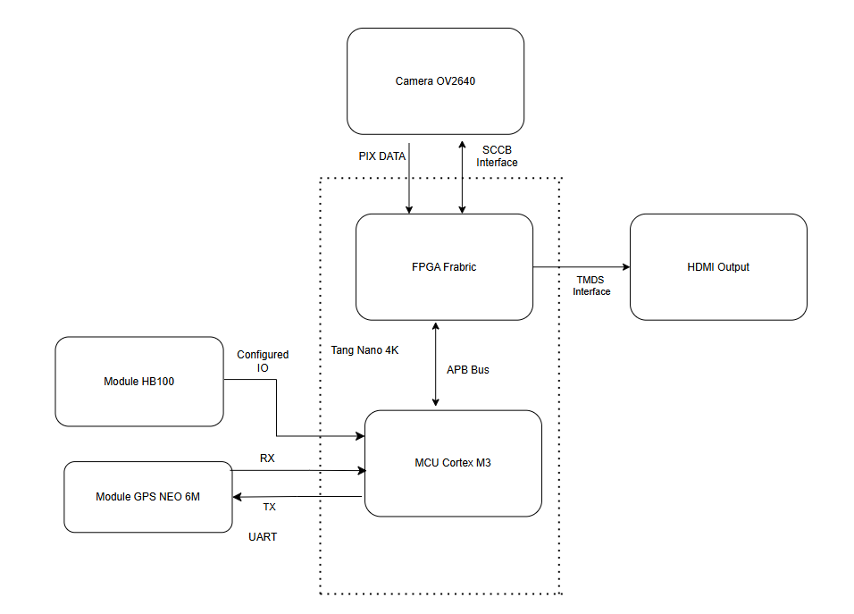
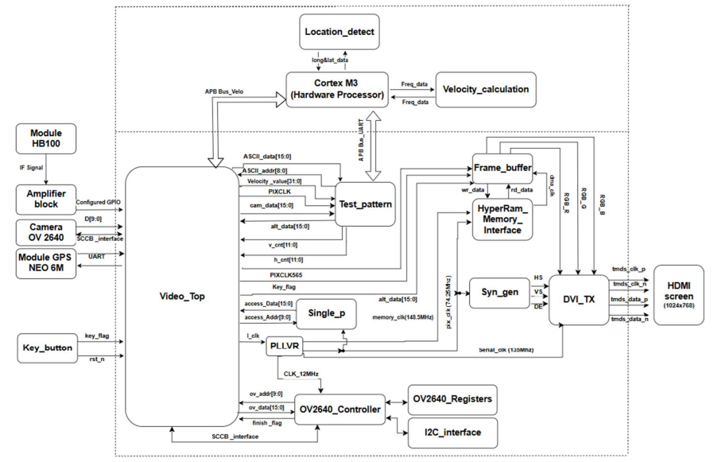
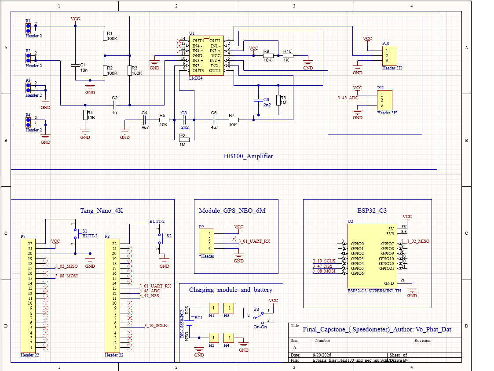
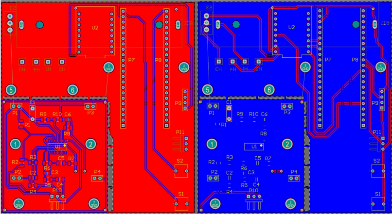
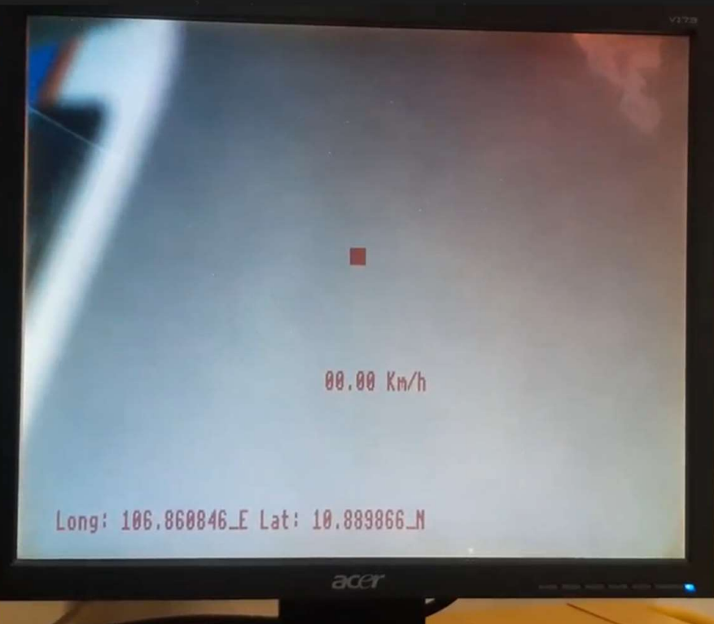
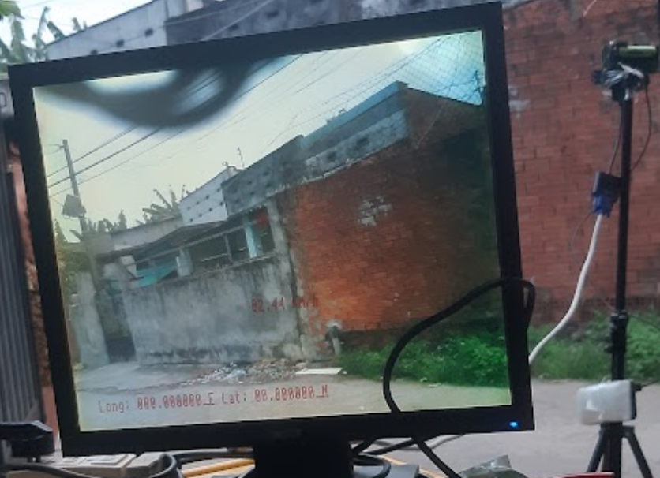

# FPGA-Based Vehicle Speed Detection and On-Image Display

This project demonstrates an **FPGA-based vehicle speed detection and on-image information display system** implemented on the **Tang Nano 4K** SoC platform.

The system integrates an **HB100 Doppler radar** for vehicle speed measurement, a **NEO-M6 GPS** module for positioning data, and an **OV2640 camera** for real-time image capture. The Tang Nano 4K processes the sensor data and video stream, then overlays the measured **vehicle speed and GPS information directly onto the captured video frame**.

## Hardware

* **Tang Nano 4K** — FPGA/SoC processing platform
* **HB100 Doppler Radar** — Vehicle speed measurement
* **NEO-M6 GPS** — Positioning and navigation data
* **OV2640** — Image capture
* **HDMI** — Video display output

## System Features

* Real-time vehicle speed measurement using the **Doppler effect**
* GPS positioning data acquisition
* Real-time image capture using the OV2640 camera
* On-image overlay of speed and GPS information
* MCU–FPGA communication through an **APB-based interface**
* HDMI video output
* FPGA-based real-time video processing

## Software
The project was developed using:

* **Gowin Programmer**
* **Gowin MCU Designer**
* **Verilog HDL**
* **C firmware**

The FPGA logic handles video processing, frame buffering, and on-image data overlay, while the embedded MCU handles sensor communication and system control.

## Hardware / PCB Design

The supporting PCB was designed using **Altium Designer**.

The PCB integrates the interfaces required for the:

* Tang Nano 4K
* OV2640 camera
* HB100 Doppler radar
* NEO-M6 GPS
* HDMI display
* Power and peripheral connections

## System Architecture


# Demonstration
  ## PCB Implementation:










#File structure
.

```
.
├── Demo/
├── final_capstone/
│   ├── bench/          # Testbench files
│   ├── c_code/         # C files
│   ├── impl/
│   ├── mem/            # BRAM bin files
│   ├── sim/            # Waveform files
│   └── src/            # Verilog source files
├── PCB_design/         # Schematic and PCB layout
└── Python_code/        # Code for ASCII to Hex conversion and OV2640 SCCB configuration
```
